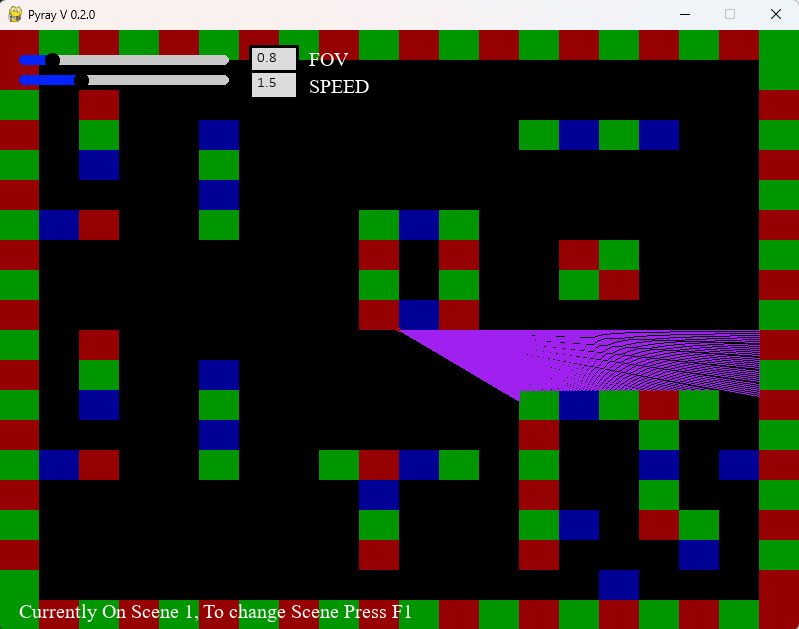
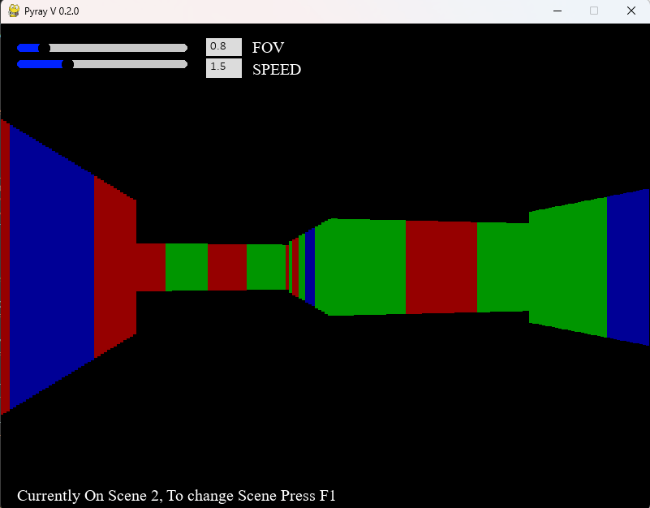

# Pyray

A simple raycasting engine built with Pygame and NumPy. This project is a basic implementation of a classic raycasting algorithm, creating a 3D perspective from a 2D map.

---

### Player Interactable
* **Player Controls:** This Demonstration uses Tank Controls:
    * **Arrow Keys:** Move forward, backward, and rotate left or right.
    * **Left Shift:** To Sprint.
    * **Spacebar:** To Dash.
    * **F1 Keys:** Switch between the 2D overhead map view and the 3D raycast view.
* **Adjustable Settings:** Using sliders on the Top Left:
    * **Field of View (FOV):** Adjust the camera's FOV.
    * **Speed:** Change the player's base movement speed.

---

### Screenshots


#### 2D View


#### 3D View


---

### How to Run

1.  **Clone the repository:**
    ```bash
    git clone https://github.com/HiraishKumar/pyray.git
    cd pyray
    ```

2.  **Install dependencies:**
    This project requires Pygame, NumPy, and Pygame-widgets. You can install them all using pip:
    ```bash
    pip install -r requirements.txt
    ```

3.  **Run the main script:**
    After installing the dependencies, simply run the `main.py` file to start the game.
    ```bash
    python main.py
    ```

---

### File Structure

* `main.py`: The main game loop, handles user input, game state, and rendering.
* `Config.py`: Stores all the constants and initial values for the game, such as screen dimensions, player speed, and the map layout.
* `Player.py`: Defines the `Player` class, which manages the player's position, direction, and movement vectors.